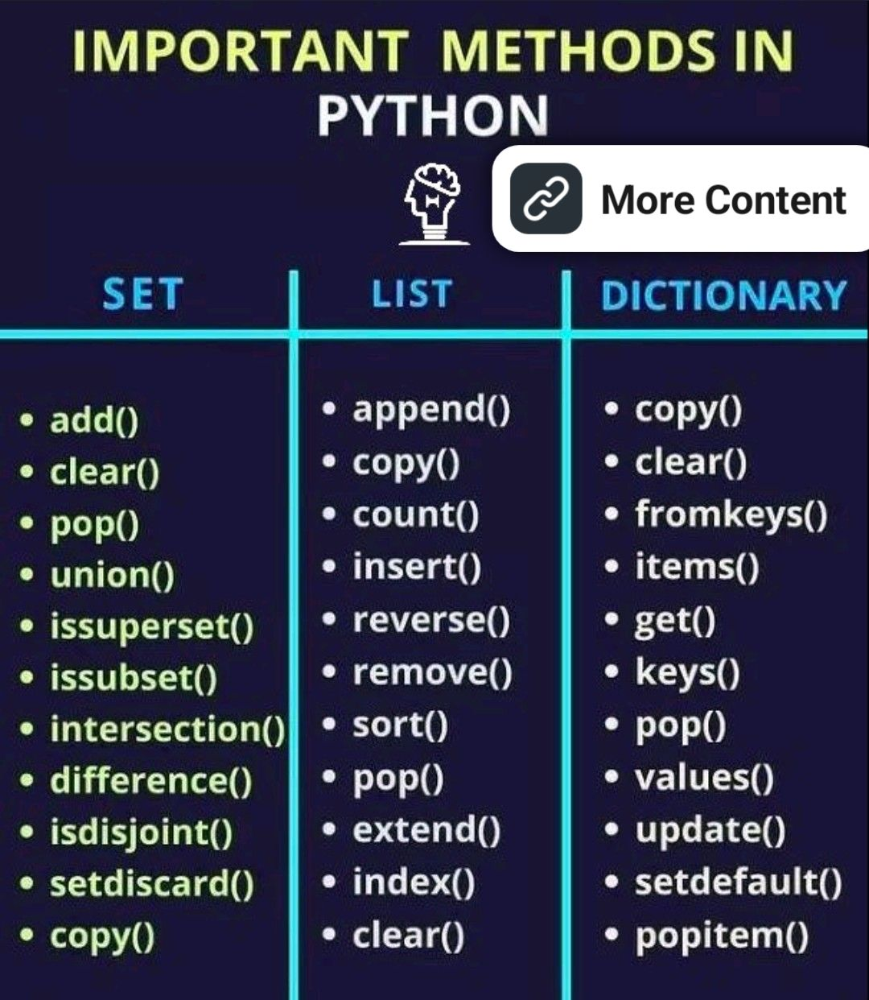

# Learning DevOPs
**This is simple read me file**
## This is the sub Heading
  *This is my italic text*

 ## Order list
 1. step 1
 2. step 2
 3. step 3
## Unoreder list
- Apple
- Mango
- Banana

> This is my quotes

The work `WHO` stands for world health organizations.

```
This is my ~~first~~ line.
This is my second line.
This is my third line.
```

if you add quotes ~~click on~~ ***up key on tab.***
 # Add the Image on github readme
  

# Add the link on github readme
  [Google](https://www.google.com)

  # Add table and create column in Github

  |col-1|col-2|col-3|
  |---|---|---|
  |name|Age|Dept|
  |Dipendra|20|AI|

  :mask:


  ## hide something in github
  <details><summary>`#0d1117`Click me</summary>
  <p>
  #### This is the Hide informations in github

```ruby
   print"Hello World"
```
  </p>

  </details>


    


